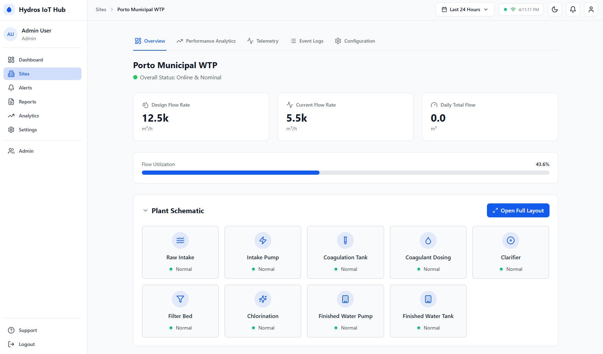

# Hydros Landing Page

A modern, visually appealing landing page for the Hydros Digital Twin & IoT Hub platform, designed for GitHub Pages deployment.

## 🎨 Features

- **Modern Design**: Gradient-based design with smooth animations and professional aesthetics
- **Responsive**: Fully responsive layout that works on all devices
- **Interactive**: Smooth scrolling, scroll animations, and interactive elements
- **Performance**: Optimized for fast loading and smooth animations
- **Static**: Pure HTML/CSS/JavaScript - no build process required

## 📁 Files

- `index.html` - Main landing page HTML structure
- `styles.css` - Comprehensive styling with modern CSS features
- `script.js` - Interactive JavaScript features
- `LANDING_PAGE.md` - This documentation file

## 🚀 Deployment to GitHub Pages

### Quick Setup

1. **Enable GitHub Pages**:
   - Go to your repository settings
   - Navigate to "Pages" section
   - Under "Source", select the branch (e.g., `main` or `gh-pages`)
   - Select root (`/`) as the directory
   - Click "Save"

2. **Access Your Site**:
   - Your site will be available at: `https://vitorbabo.github.io/hydros/`
   - It may take a few minutes for the site to be published

### Custom Domain (Optional)

To use a custom domain:

1. Add a `CNAME` file to the repository root with your domain name
2. Configure your DNS settings to point to GitHub Pages
3. Enable "Enforce HTTPS" in GitHub Pages settings

## 📸 Adding Screenshots/GIFs

The landing page includes several placeholder areas for visual content. Replace these with actual screenshots or GIFs of your application:

### Placeholder Locations

1. **Hero Section** (`dashboard.png` or `dashboard.gif`)
   - Main dashboard view
   - Recommended size: 1920x1080px or larger
   - Shows the primary user interface

2. **Simulation Mode** (`simulation-mode.gif`)
   - Animated GIF showing simulation in action
   - Recommended size: 800x600px
   - Shows physics-based simulation features

3. **Gateway Mode** (`gateway-mode.gif`)
   - Animated GIF showing real-time data collection
   - Recommended size: 800x600px
   - Shows production PLC integration

4. **Architecture Diagram** (`architecture-diagram.png` or `.svg`)
   - System architecture visualization
   - Recommended size: 1200x800px
   - Can be created with tools like draw.io or Lucidchart

5. **Dashboard Demo** (`dashboard-demo.gif`)
   - Live monitoring interface
   - Recommended size: 1000x700px
   - Shows real-time sensor updates

6. **Analytics Demo** (`analytics-demo.gif`)
   - Analytics and reporting features
   - Recommended size: 1000x700px
   - Shows charts and AI-powered insights

7. **Configuration Demo** (`config-demo.gif`)
   - Multi-site configuration interface
   - Recommended size: 1000x700px
   - Shows site management features

### How to Replace Placeholders

There are two methods to add images:

#### Method 1: Replace Placeholder Divs (Recommended)

1. Save your images in the repository root or in an `assets/` folder
2. Open `index.html`
3. Find the placeholder divs (search for `screenshot-placeholder`)
4. Replace the entire div with an `` tag:

```html
<!-- Before -->
<div class="screenshot-placeholder hero-screenshot">
    <svg>...</svg>
    <p>Dashboard Screenshot</p>
    <span class="placeholder-hint">Replace with dashboard.png</span>
</div>

<!-- After -->

```

#### Method 2: Use Data Attributes (Lazy Loading)

1. Save your images in an `assets/` folder
2. Add `data-src` attribute to placeholders:

```html
<div class="screenshot-placeholder hero-screenshot" data-src="assets/dashboard.png">
    <!-- content -->
</div>
```

The JavaScript will automatically load and display the image when it comes into view.

## 🎬 Creating GIFs

### Tools for Creating GIFs

- **Screen Recording**:
  - macOS: QuickTime Player + [Gifski](https://gif.ski/)
  - Windows: [ScreenToGif](https://www.screentogif.com/)
  - Linux: [Peek](https://github.com/phw/peek)
  - Cross-platform: [LICEcap](https://www.cockos.com/licecap/)

- **Video to GIF Conversion**:
  - [ezgif.com](https://ezgif.com/)
  - [CloudConvert](https://cloudconvert.com/)
  - [FFmpeg](https://ffmpeg.org/) (command line)

### GIF Best Practices

1. **Duration**: Keep GIFs between 3-10 seconds
2. **Size**: Optimize to keep file size under 5MB
3. **FPS**: Use 10-15 FPS for smooth playback
4. **Resolution**: Match the placeholder size recommendations
5. **Colors**: Reduce color palette if file size is too large
6. **Loop**: Set to loop infinitely

### Example FFmpeg Command

```bash
# Convert video to optimized GIF
ffmpeg -i input.mp4 -vf "fps=10,scale=800:-1:flags=lanczos,split[s0][s1];[s0]palettegen[p];[s1][p]paletteuse" -loop 0 output.gif
```

## 🎨 Customization

### Colors

Edit CSS variables in `styles.css`:

```css
:root {
    --primary: #3B82F6;
    --secondary: #06B6D4;
    --accent: #8B5CF6;
    /* ... more variables ... */
}
```

### Content

Edit text directly in `index.html`:

- Hero title and description
- Feature descriptions
- Statistics
- Footer links
- etc.

### Animations

Adjust animation speeds and effects in `styles.css`:

```css
@keyframes fadeInUp {
    /* ... animation keyframes ... */
}

.scroll-reveal {
    transition: all 0.6s ease; /* Adjust timing here */
}
```

## 🔧 Local Testing

To test the landing page locally:

1. **Simple HTTP Server** (Python):
   ```bash
   # Python 3
   python -m http.server 8000

   # Then visit http://localhost:8000
   ```

2. **Node.js HTTP Server**:
   ```bash
   npx http-server
   ```

3. **VS Code Live Server**:
   - Install "Live Server" extension
   - Right-click `index.html` > "Open with Live Server"

## 📱 Responsive Breakpoints

- **Desktop**: 1024px and above
- **Tablet**: 768px to 1023px
- **Mobile**: 767px and below

The design automatically adapts to different screen sizes.

## ♿ Accessibility

The landing page includes:

- Semantic HTML5 elements
- ARIA labels for interactive elements
- Sufficient color contrast
- Keyboard navigation support
- Screen reader friendly structure

## 🚀 Performance Tips

1. **Optimize Images**:
   - Use WebP format for better compression
   - Compress PNG/JPG files
   - Use appropriate image sizes

2. **Lazy Loading**:
   - The JavaScript includes lazy loading for images
   - Add `loading="lazy"` to img tags

3. **Minification** (Production):
   ```bash
   # CSS
   npx csso styles.css -o styles.min.css

   # JavaScript
   npx terser script.js -o script.min.js
   ```

## 📊 Analytics (Optional)

To add analytics, include your tracking code before `</body>` in `index.html`:

```html
<!-- Google Analytics -->
<script async src="https://www.googletagmanager.com/gtag/js?id=GA_MEASUREMENT_ID"></script>
<script>
  window.dataLayer = window.dataLayer || [];
  function gtag(){dataLayer.push(arguments);}
  gtag('js', new Date());
  gtag('config', 'GA_MEASUREMENT_ID');
</script>
```

## 🤝 Contributing

To improve the landing page:

1. Fork the repository
2. Create a feature branch
3. Make your changes
4. Test on multiple devices/browsers
5. Submit a pull request

## 📄 License

This landing page is part of the Hydros project and follows the same license (MIT).

## 🙋 Support

For issues or questions about the landing page:

- Open an issue on GitHub
- Check the main project README
- Contact the maintainers

---

**Note**: Remember to replace all placeholder images with actual screenshots before deploying to production!
