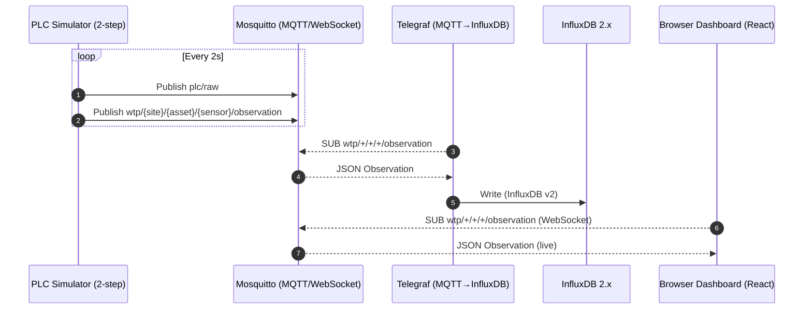

## Hydros PoC

PLC Simulator (2-step) → MQTT (Mosquitto) → Ingestion (Telegraf) → TSDB (InfluxDB) → Dashboard (React)

### Sequence Diagram


- Raw publish to `plc/raw`: *{ site_id, source, seq, ts, tags{DB1.DBW100, DB1.DBW102} }*

- Standardized publish to `wtp/{site}/{asset}/{sensor}/observation`: *{site_id, asset_id, sensor_id, measurement, ts, value, unit, quality, raw_tag, source, seq}*

### Run

Requirements: Docker + Docker Compose.

```bash
docker compose up -d --build
```

Services:
- Mosquitto: MQTT `localhost:1883`, WebSocket `ws://localhost:9001`
- InfluxDB: http://localhost:8086 (org: hydros, bucket: wtp, token: hydros-token)
- Dashboard: http://localhost:5173

### Data Contracts

- Simulator → MQTT `plc/raw`:
```json
{
  "site_id": "wtp-porto-01",
  "source": "siemens-s7-1200",
  "seq": 123,
  "ts": "2025-08-11T09:23:12Z",
  "tags": { "DB1.DBW100": 3.42, "DB1.DBW102": 54.1 }
}
```

- Standardized observation payload (topic: `wtp/{site}/{asset}/{sensor}/observation`):
```json
{
  "site_id": "wtp-porto-01",
  "asset_id": "clarifier-1",
  "sensor_id": "lvl-clarifier-1",
  "measurement": "level",
  "ts": "2025-08-11T09:23:12Z",
  "value": 3.42,
  "unit": "m",
  "quality": "good",
  "raw_tag": "DB1.DBW100",
  "source": "siemens-s7-1200",
  "seq": 123
}
```

### Notes
- Telegraf subscribes `wtp/+/+/+/observation` and `plc/raw` and writes to InfluxDB `hydros/wtp`.
- The React dashboard subscribes via WebSocket to `ws://localhost:9001` and plots the live series.

